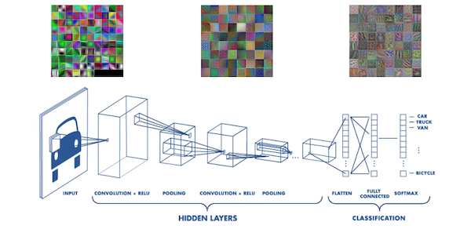
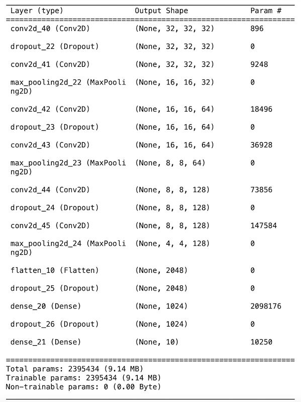
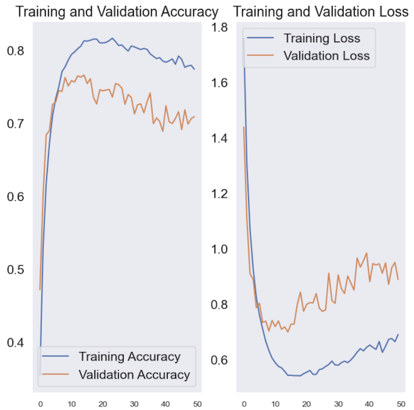
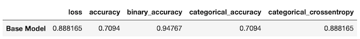
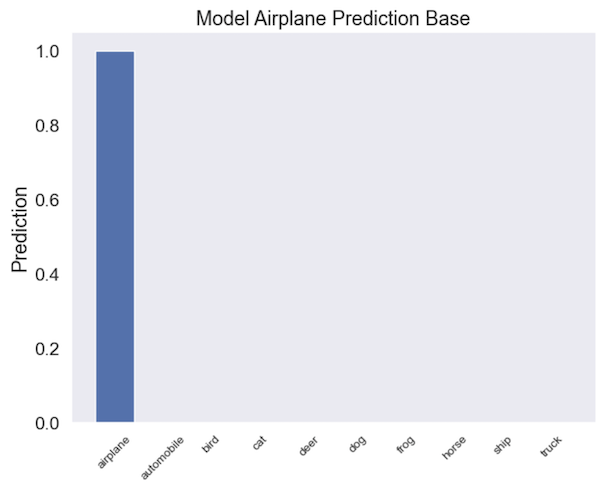

    

        
    

### Business Understanding

#### Deep Learning with Convolutional Neural Networks (CNNs)

Computer vision was the harbinger and beneficiary of deep learning. We interact with deep vision models without realizing it. Google Photos, OCR applications, security systems, and many more utilize this technology. These models are also used in robotics, autonomous vehicles and even farming. Its rise between 2011 and 2015 was demarked by the winning of the ImageNet challenge in 2012 and deep learning was widely adoted in 2016.

#### Why CNNs?

This project is a precursor to future work involving generative AI (GenAI) in the context of image generation. The need to correctly classify images is also essential in generative adverserial networks (GANs) where two "competing" networks are used. Understanding the advantages, disadvantages and limitations of existing models will facilitate correct model selection and a deeper understanding of optimal configuration.

#### How CNNs Work

CNNs are composed from three main types of layers:

- Convolutions
- Pooling
- Fully-connected (FC)

The convolution layer is the first layer. It can be followed by subsequent convolution layers and/or pooling layers. The fully-connected layer is the last layers. As the image progresses through the model's layers, each layer focuses on the image's simple features like edges and colors. These layer transitions allow the CNN to begin identifying larger components of the image until arriving at identification.

##### The Convolution Layer

This is the fundamental layer of the CNN and it is here that most of the computation occurs. Its components include the input image, a feature map and a filter. The input image is a matrix representation containing the pixel values. If the input image is color, this is a 3x3 matrix of width and height corresponding to the image dimensions. The filter (also called a kernel of feature detector). It traverses the image to determine if a feature is present. This process is what gives this layer its name: convolution.

The filter is a two-dimensional array of weights representing a portion of the image; typically a matrix of size 3x3. This filter is applied to part of the image and the dot product of the area "under" the filter is calculated and fed into an output array. The filter then shifts (via a parametrized "stride") to a different part of the image and the process is repeated for the whole image. The result is a feature map (also known as a convoluted feature or activation map). The filter weights remain fixed as it traverses the image. During backpropagation and gradient descent, these weights can be adjusted as the model trains on the dataset.

Image credit [Illarion Khlestov](https://ikhlestov.github.io/)

There are also three important hyperparameters that need to be set before training a model that affect its output:

- The number of filters: affect the depth of the output
- Strinde: mentioned above, determines the number of pixels the filter moves across the image
- Padding: used when the filter (and its strides) does not fit the image

After the convolution completes, a Rectified Linear Unit (ReLU) is applied to the filter which introduces non-linearity to the CNN model.

Convolution layers are generally layered. One can think of this progression as creating a hierarchical representation of the subject image.

##### Pooling Layer

The pooling layer can be though of as a down-sampling layer; it reduces the number of parameters from the input. Like the concolution layer, the pooling layer also travers the entire image using a filter. This time, however, the filter does not have any weights. An aggregation function is used instead. There are two types of pooling layers: max pooling (selects the pixels with the maximum value & passes these to the output array), average pooling (calculates the averate pixel value & passes these to the output array)

##### Fully-connected (FC) Layer

This is the final layer in a "connected" network model. Its task is to produce a probabilistic classification (0 or 1) based on the features extracted from the previous layers and their filters. Generally, this layer uses the softmax activation function (vs the ReLU).

[Image Credit](https://external-content.duckduckgo.com/iu/?u=https%3A%2F%2Fuser-images.githubusercontent.com%2F57826388%2F73771230-50517f80-47c1-11ea-9430-785c53e2e3cf.png&f=1&nofb=1&ipt=b23b401bcd740c758a75f6d5f4224989be625165365b2c43c1dde5fca590bd9d&ipo=images)

### Project Overview

This project provides a glimpse into CNNs for classifying images. Four models were use: a base model to establish a rudementary benchmark and 3 hand-coded representations of LeNet15, AlexNet and VGGNet16. 

#### Data

The CIFAR10 dataset (50,000 images 32x32 pixels containing 10 categories) was used to train the base and LeNet15 models. The Oxford University's flower dataset was used for AlexNet and VGGNet16 (3,670 227x277 pixels containing 5 categories). This data was used without the need for cleaning thanks to the authors.

#### CNN Models

Besides the base model, the remaining three models were fitted "as is" followed by adding image augmentation layers, ending with the image augmentation accompanied by a "dropout" layer. Therefore, LeNet15, AlexNet and VGGNet16 architectures were ran three times each.

#### Metrics

After each iteration, a model's accuracy, validation accuracy, loss, and validation loss were plotted (below). Furthermore, each model also generated metrics for binary accuracy, categorical accuracy and categorical crossentropy. "Accuracy" was selected (vs. precision for example) as the primary metric of interest since its importance in correctly identifying (classifying) and image. However, "categorical accuracy" is also important since the loss function for all models is "categorical crossentropy". These metrics are included in tabular for below.

### Comparison of Four CNN Models

#### Base Model

The base model was created using the Keras CIFAR10 classification [example](https://ermlab.com/en/blog/nlp/cifar-10-classification-using-keras-tutorial/)

Its 6 convolution layers start with a 32x32x3 (the last being RGB) matrix inputs. Dropout (random omission of features) is set to 20% and several max-pooling layers are interwoven. The network ends at a 'dense' layer with a softmax activation.

Below are the model's accuracy and loss plots:

The accuracy plot ilustrates that the base model trained fairly well within the first 10 epochs around which time the validation scores began to decrease, suggesting overfitting. The loss plot shows a good learning rate reached within the same time persiod when it started to increase; supported by the validation loss. The repetitive, step-like progression on both graphs suggest that the input data may contain repetitive features. Taking into account that the input data is very small (32x32) pixels, it would be difficult for the human eye to distinguish images.

An image of an airplane was used (scaled to the correct input size) in a distinct prediction and inspite of the model's poor performance metrics, it made the correct prediction.

