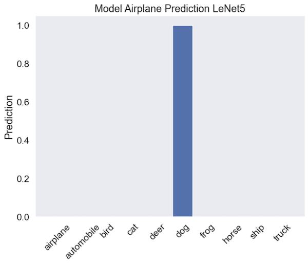

### Deep Learning with Convolutional Neural Networks (CNNs)

<p align="center">
  
</p>

#### Business Understanding

Computer vision was the harbinger and beneficiary of deep learning. We interact with deep vision models without realizing it. Google Photos, OCR applications, security systems, and many more utilize this technology. These models are also used in robotics, autonomous vehicles and even farming. Its rise between 2011 and 2015 was demarcated by the winning of the ImageNet challenge in 2012 and deep learning was widely adopted in 2016.

#### Why CNNs?

This project is a precursor to future work involving generative AI (GenAI) in the context of image generation. The need to correctly classify images is also essential in generative adversarial networks (GANs) where two "competing" networks are used. Understanding the advantages, disadvantages and limitations of existing models will facilitate correct model selection and a deeper understanding of optimal configuration.

#### How CNNs Work

CNNs are composed from three main types of layers:

- Convolution
- Pooling
- Fully-connected (FC)

The convolution layer is the first layer. It can be followed by subsequent convolution layers and/or pooling layers. The fully-connected layer is the last layers. As the image progresses through the model's layers, each layer focuses on the image's simple features like edges and colors. These layer transitions allow the CNN to begin identifying larger components of the image until arriving at identification.

##### The Convolution Layer

This is the fundamental layer of the CNN and it is here that most of the computation occurs. Its components include the input image, a feature map and a filter. The input image is a matrix representation containing the pixel values. If the input image is color, this is a 3x3 matrix of width and height corresponding to the image dimensions plus a third dimension representing each pixel's color (eg. RGB). The filter (also called a kernel of feature detector) traverses the image to determine if a feature is present. This process is what gives this layer its name: convolution.

The filter is a two-dimensional array of weights representing a portion of the image; typically a matrix of size 3x3. This filter is applied to part of the image and the dot product of the area "under" the filter is calculated and fed into an output array. The filter then shifts (via a parametrized "stride") to a different part of the image and the process is repeated for the whole image. The result is a feature map (also known as a convoluted feature or activation map). The filter weights remain fixed as it traverses the image. During back-propagation and gradient descent, these weights can be adjusted as the model trains on the dataset.


Image credit [Illarion Khlestov](https://ikhlestov.github.io/)

There are also three important hyperparameters that need to be set before training a model that affect its output:

- The number of filters: affect the depth of the output
- Stride: mentioned above, determines the number of pixels the filter moves across the image at each iteration (see animation above)
- Padding: used when the filter (and its strides) does not fit the image

After the convolution completes, a Rectified Linear Unit (ReLU) is applied to the filter which introduces non-linearity to the CNN model.

Convolution layers are generally layered. One can think of this progression as creating a hierarchical representation of the subject image.

##### Pooling Layer

The pooling layer can be though of as a down-sampling layer; it reduces the number of parameters from the input. Like the convolution layer, the pooling layer also travers the entire image using a filter. This time, however, the filter does not have any weights. An aggregation function is used instead. There are two types of pooling layers: max pooling (selects the pixels with the maximum value & passes these to the output array), average pooling (calculates the average pixel value & passes these to the output array)

##### Fully-connected (FC) Layer

This is the final layer in a "connected" network model. Its task is to produce a probabilistic classification (0 or 1) based on the features extracted from the previous layers and their filters. Generally, this layer uses the softmax activation function (vs the ReLU).


[Image Credit](https://external-content.duckduckgo.com/iu/?u=https%3A%2F%2Fuser-images.githubusercontent.com%2F57826388%2F73771230-50517f80-47c1-11ea-9430-785c53e2e3cf.png&f=1&nofb=1&ipt=b23b401bcd740c758a75f6d5f4224989be625165365b2c43c1dde5fca590bd9d&ipo=images)

### Project Overview

This project provides a glimpse into CNNs for classifying images. Four models were use: a base model to establish a rudimentary benchmark and 3 hand-coded representations of LeNet15, AlexNet and VGGNet16. 

#### Data

The CIFAR10 dataset (50,000 images 32x32 pixels containing 10 categories) was used to train the base and LeNet15 models. The Oxford University's flower dataset was used for AlexNet and VGGNet16 (3,670 227x277 pixels containing 5 categories). This data was used without the need for cleaning thanks to the authors.

#### CNN Models

Besides the base model, the remaining three models were fitted "as is" followed by adding image augmentation layers, ending with the image augmentation accompanied by a `Dropout` layer. Therefore, LeNet15, AlexNet and VGGNet16 architectures were ran three times each. All models were fitted over fifty epochs.

#### Metrics

After each iteration, a model's accuracy, validation accuracy, loss, and validation loss were plotted. Furthermore, each model also generated metrics for binary accuracy, categorical accuracy and categorical cross-entropy. "Accuracy" was selected (vs. precision for example) as the primary metric of interest since its importance in correctly identifying (classifying) and image. However, "categorical accuracy" is also important since the loss function for all models is "categorical crossentropy". These metrics are included in tabular form below.

### Comparison of Four CNN Models

#### Base Model

The base model was created using the Keras CIFAR10 classification [example](https://ermlab.com/en/blog/nlp/cifar-10-classification-using-keras-tutorial/)


Its 6 convolution layers start with a 32x32x3 (the last being RGB) matrix inputs. It has a very `Dense` (1024) layer before a "dropout" (random omission of features) layer set to 20% and several max-pooling layers are interwoven. The network ends at a `Dense` layer with a softmax activation.

Below are the model's accuracy and loss plots:


The accuracy plot illustrates that the base model trained fairly well within the first 10 epochs around which time the validation scores began to decrease, suggesting overfitting. The loss plot shows a good learning rate reached within the same time period when it started to increase; supported by the validation loss. The repetitive, step-like progression on both graphs suggest that the input data may contain repetitive features. Taking into account that the input data is very small (32x32) pixels, it would be difficult for the human eye to distinguish between images.


An image of an airplane was used (scaled to the correct input size) in a distinct prediction and in spite of the model's poor performance metrics (loss: 88%, accuracy: 70%), it made the correct prediction.


#### LeNet5 Model

The LeNet5 model was constructed via the Kaggle [example](https://www.kaggle.com/code/blurredmachine/lenet-architecture-a-complete-guide) and uses the same CIFAR10 data as the base model.


This is a simpler model than the base, containing only two convolution layers. There are no `Dropout` layers in this model but the last three dense layers titrate from 120 to 84 to 10 and finally to the output layer with a softmax activation.


In comparison to the base model, the LeNet5 model trained better over the span of 50 epochs, but suffered in-accuracy (59%) and validation losses very early on in training.



"Out of the box", this model identified the airplane image mentioned above as a dog.

#### LeNet5 Model with Image Augmentation

The above model was amended by introducing image augmentation
```
RandomFlip("horizontal", input_shape=(32, 32, 3))
RandomRotation(0.1)
RandomZoom(0.1)
```
as the first three layers. The resulting validation plots


show the same learning rate as the previous iteration. It is interesting to see that the validation accuracy and loss adhere much closer to the training rate but exhibit repetitive steps suggesting a learning rate (0.01) that overshoots the target.

In spite of its poor performance (accuracy:59%), this model made the correct prediction:


#### LeNet5 Model with Image Augmentation and Dropout

This model was copied from the above and ammended with `Dropout(0.2)` preceding the `Flatten` layer.


Although accuracy (59%) remained similar to it predicessor, the accuracy and loss validations, depart from the training rate which is also lower than in the earlier models. This is a bit surprising since the training set contained 153,600,000 images. When the data was initially split into training & testing sets, it was not shuffled; if the data was not well distributed, this could suggest the lack of "randomness" necessary for the `Dropout` to be of benefit.

This table summarizes the scores collected for the three variants of LeNet5


#### AlexNet Model

This AlexNet model was constructed via the Kaggle [example](https://www.kaggle.com/code/blurredmachine/alexnet-architecture-a-complete-guide)


Like the up-coming VGGNet16 model, this model uses the Oxford University flower dataset. The image input size is now 227x227x3, however, there are only 3,670 samples in 5 categories (daisy, dandelion, roses, sunflowers, tulips). It contains 4 convolution layers followed by an interesting pair of `Dense` layers of size 4,096. Again, the last `Dense` layer uses the softmax activation.


These two plots display a very strong overfitting probably due to the small dataset size (validation size is 1,101 sample) in spite of a reasonable, yet uncertain, learning rate.

Like before, a distinct image of a rose was used for the model to predict


And the model made the correct prediction


#### AlexNet Model with Image Augmentation

As before, the original model was ammended with image manipulation at the bottom of the network.


Compared to its predicessor, this model makes an effort to improves accuracy and decrease loss; both progressions attempt to get closer to the training rate. The training rate is more gradual yet more uncertain starting around the tenth epoch. The accuracy improvement (from 71% in the above model to 74%) is encouraging. However, when the distinct rose image is used to make a prediction


this model thinks its looking at a tulip.

#### AlexNet Model with Image Augmentation and Dropout

The final augmentation to the AlexModel is the addition of `Dropout`.


The loss metrics appear less sporadic, with fewer jagged steps. The accuracy score of 75% hints of a better prediction of the rose image


Indeed, the `Dropout` has improved the prediction, yet still hinting at a ~15% presence of "tulips" in the image.

The table below summarizes the metrics for the three AlexNet variants described above:


#### VGGNet16 Model

The final and most ambitions model used is the VGGNet 16 model. The "16" layer version was selected since it resides in the middle of VGGNet models in respect to complexity. This model was constructed using Kaggle [example](https://www.kaggle.com/code/blurredmachine/vggnet-16-architecture-a-complete-guide).

This model is comprised of 13 convolution layers and takes 224x224 images as input (vs the 227x227 needed for AlexNet). The same "flowers" dataset was used as for AlexNet.


The accuracy validation plot show very strong overfitting. The validation loss is the highest from all of the previous models, again, suggesting that the dataset for this complex model was insufficient.


Surprisingly, however, this model made the correct "rose" prediction


#### VGGNet16 Model with Image Augmentation

The image-augmented version of the VGGNet16 model displayed an improved training accuracy trend; although with more uncertainty. Still overfitted, but less so than its non-augmented counterpart, the validation loss decreased substantially.


The prediction, however was similar to the AlexNet + image augmentation + Dropout, favoring the "tulips" more.


#### VGGNet16 Model with Image Augmentation and Dropout

The final model in this comparison adds `Dropout` to its predecessor.


There are subtle improvements in the training accuracy and validation loss. Both seems to near their training counterparts and the curves are less sporadic.


We can see an improvement in the rose prediction where the "tulips" misclassification drops to around 30%; vs the non-dropout variant of ~45%. "dandelion" is also introduced, which is interesting how a completely different-looking "flower" structure could be confused with that of a rose.

Below is a summary of the VGGNet 16 metrics collected in this model's comparison:


#### Model Fit Times

These models were ran on a 2021 MacBookPro with a M1 Max processor (8 cores). Attempts were made to leverage GPU/TPU resources via Google Colab, but the length of time it took for these models to run, forced sessions to time out and disconnect.
Below is a plot of the fit times


Note that the "VGGNet16 Model with Image Augmentation" is probably an anomaly due to the machine going to "sleep". In spite of this, it is clear that the most complex model, VGGNet 16, took an overwhelmingly longer time to fit than the other models (~8.3 hours).

#### Conclusion

This project illustrates that producing accurate and performant CNNs for image classification is not a trivial task. Architectures that are commonly available in frameworks like Keras still require careful selection and the optimization of hyper-parameters. Input data is a crucial precursor, both in quality and quantity. Computational power for larger models is necessary to reduce training time.

#### Future Work

The VGGNet 16 model trained in around eight hours with marginal results for all three variants. It is necessary to compare performance of any of these models utilizing `GridSearchCV`, for example. Selecting ranges of epochs, optimizers (`Adam`, `SGD` etc.), learning rate, momentum, network weight initialization, neuron activation functions, dropout regularization, and the number of neurons in hidden layers. To reduce training time, parallelizing this process using AWS instances. 

#### Files

*  [Base Model](BaseModel.ipynb)
*  [AlexNet](AlexNet.ipynb)
*  [LeNet5](LeNet5.ipynb)
*  [VGGNet16](VGGNet16.ipynb)

#### Running the Examples

All of the models were created as Jupyter notebooks. They can be ran locally in Anaconda or imported into Google Colab (I mentioned earlier some limitations due to long-running fit/train).

#### References

* Header image: [Remote Sensing](https://www.researchgate.net/figure/Overview-and-details-of-a-convolutional-neural-network-CNN-architecture-for-image_fig2_341576780)

* [Base Model](https://ermlab.com/en/blog/nlp/cifar-10-classification-using-keras-tutorial/)
* [LeNet5 Model](https://www.kaggle.com/code/blurredmachine/lenet-architecture-a-complete-guide)
* [LeNet](https://en.wikipedia.org/wiki/LeNet)
* [Writing LeNet5 from Scratch in PyTorch](https://blog.paperspace.com/writing-lenet5-from-scratch-in-python/)
* [AlexNet Model](https://www.kaggle.com/code/blurredmachine/alexnet-architecture-a-complete-guide)
* [AlexNet Architecture: A Complete Guide](https://www.kaggle.com/code/blurredmachine/alexnet-architecture-a-complete-guide)
* [Building AlexNet with Keras](https://www.mydatahack.com/building-alexnet-with-keras/)
* [Deep Convolutional Neural Networks (AlexNet)](https://d2l.ai/chapter_convolutional-modern/alexnet.html#alexnet)
* [VGGNet16 Model](https://www.kaggle.com/code/blurredmachine/vggnet-16-architecture-a-complete-guide)
* [VGG16 – Convolutional Network for Classification and Detection](https://neurohive.io/en/popular-networks/vgg16/)
* [VGG16 model for Keras](https://gist.github.com/baraldilorenzo/07d7802847aaad0a35d3)
* [Understanding VGG16: Concepts, Architecture, and Performance](https://datagen.tech/guides/computer-vision/vgg16)
* [how-to-build-a-convnet-for-cifar-10-and-cifar-100-classification-with-keras](https://github.com/christianversloot/machine-learning-articles/blob/main/how-to-build-a-convnet-for-cifar-10-and-cifar-100-classification-with-keras.md)
* [Convolutional Layers](https://ikhlestov.github.io/pages/machine-learning/convolutional-layers/)
* [How to Use Metrics for Deep Learning with Keras in Python](https://machinelearningmastery.com/custom-metrics-deep-learning-keras-python/)
* [Transfer Learning in Action: From ImageNet to Tiny-ImageNet](https://towardsdatascience.com/transfer-learning-in-action-from-imagenet-to-tiny-imagenet-b96fe3aa5973)
* [Manning, Ch 6: Teaching Machines to See](https://github.com/thushv89/manning_tf2_in_action/blob/0e8080fe7eaae90f3afe73bde3822b2a68dc90f5/Ch06-Image-Classification-with-CNNs/6.1.Image_Classification.ipynb)
* [PyTorch Ignite Tutorial— Classifying Tiny ImageNet with EfficientNet](https://towardsdatascience.com/pytorch-ignite-classifying-tiny-imagenet-with-efficientnet-e5b1768e5e8f)
